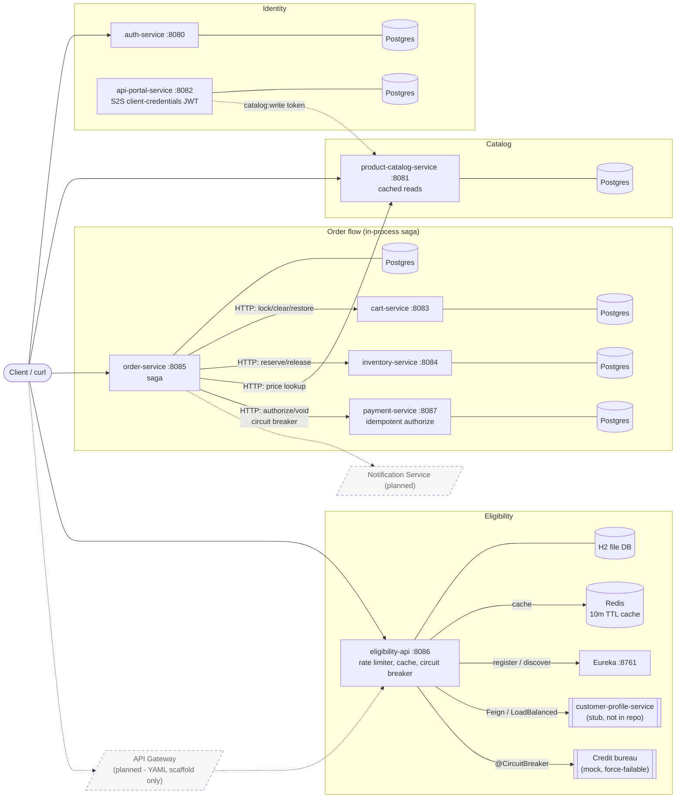

# High-Level Architecture

**Legend:** solid = implemented; dashed = planned or scaffold only.

**Notes**
- Ports come from `docker-compose.yml`.
- Edges from `order-service` come from its `CART_SERVICE_URL`, `INVENTORY_SERVICE_URL`, `CATALOG_SERVICE_URL`, and `PAYMENT_SERVICE_URL` settings.
- The payment edge is authorize and void. A Resilience4j circuit breaker named `payment` sits on the order-service client. Declines do not open it. An open circuit fails authorize as `PAYMENT_UNAVAILABLE`.
- The portal-to-catalog edge is token issuance, not a runtime call: catalog validates tokens the portal signs.
- Not verified: which other services (cart, inventory) validate portal tokens.
